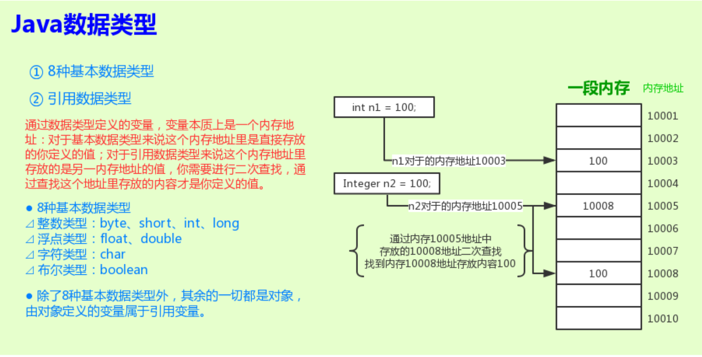
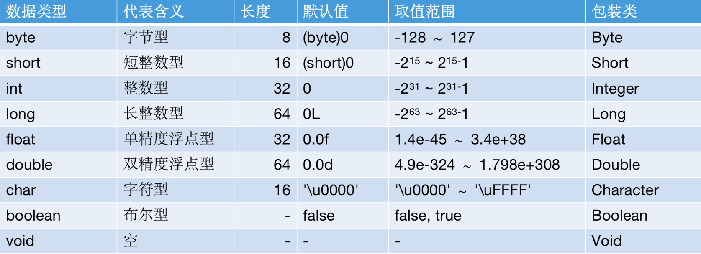
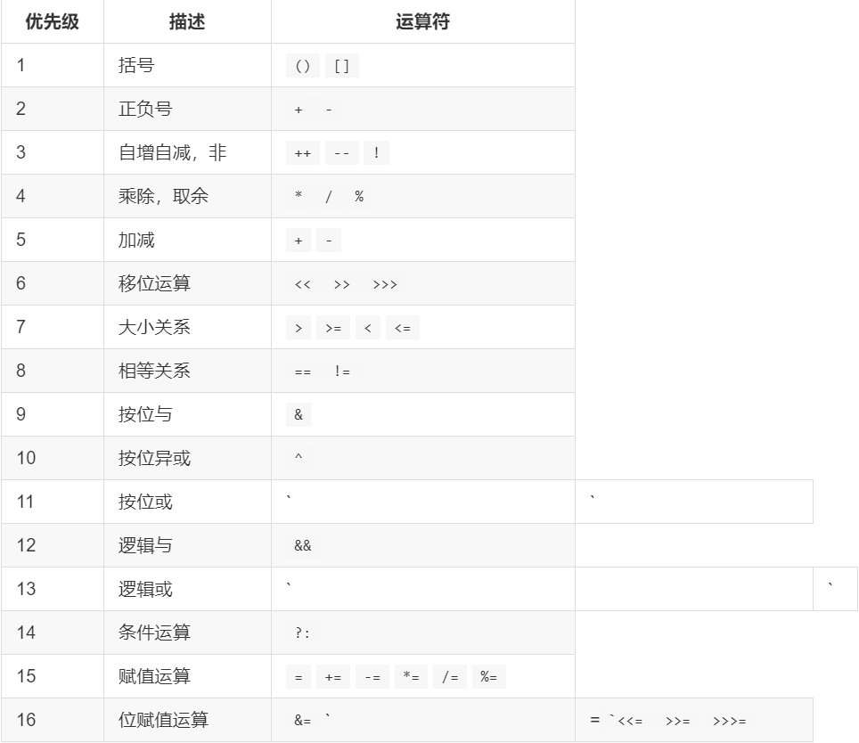

# Java Lesson

## Java基本数据类型

## 2019-12-03

### 公告

## 数据类型

- Java 是一种强类型语言，我们必须为每一个变量声明一种类型。数据类型限制了变量可以持有的值和表达式可以产生的值，以及在这些值上可以进行的操作。强类型机制有助于在编译时探测错误

- 在 Java 中，数据类型分为两类：基本数据类型（Primitive Type）和引用类型（Reference Type）。基本数据类型包括整数类型（byte、short、int 和 long）、浮点类型（float 和 double）、字符类型（char）和布尔类型（boolean）。引用类型包括类类型、接口类型、数组类型和一个特殊的空类型（null空指针）

- 有两种数据类型，相应的就有两种数据值，它们可以被存储在变量中。基本数据类型定义的变量存储的是值，而引用类型定义的变量存储的则是对象的引用（引用值）

### 基本数据类型

- Java 是一门面向对象的语言，一切都可以被视为对象。但基于工程上的考虑，Java 引入了8中基本类型，它们能够在执行效率以及内存使用上提升软件性能
- 8种基本数据类型包括：
    - 整数类型：`byte`、`short`、`int`、`long`
    - 浮点类型：`float`、`double`
    - 字符类型：`char`
    - 布尔类型：`boolean`

#### 1 整数类型

- 整数用于表示没有小数部分的数值，允许负数。4 种整数类型：byte、short、int、long，仅存储空间和表示的数据范围不同
- 长整型数值有一个后缀 L，如：5000000000L
- 十六进制数值有一个前缀 0x，如：0x0F 表示15 
- 八进制数值有一个前缀0，如：010 表示8
- 从 Java7 开始，使用0b前缀表示二进制数，而且还可以为数字加下划线，如：0b1111_0100_0010_0100_0000
```
// 下边赋值语句超过 short 的最大值 32767，程序在编译时就会报错
// short s1 = 32768;

// 数值计算时如果计算结果超长了，程序不会报任何错误，会给你一个错误的结果
Integer n1 = 2 * Integer.MAX_VALUE;
System.out.println(n1);

long n2 = 1000L;
System.out.println(n2);

int n3 = 0x0F;
System.out.println(n3);

int n4 = 010;
System.out.println(n4);

int n5 = 0b1_0001;
System.out.println(n5);
```
#### 2 浮点类型

- 浮点类型用于表示有小数部分的数值。
- float类型的数值有一个后缀F，例如：3.14F
- 没有后缀的浮点数值默认为double，也可以使用后缀D，例如：3.14 或者 3.14D
- 浮点数值不适合用于禁止出现舍入误差的金融计算中，可以使用BigDecimal类等方案来代替
- 表示溢出和出错情况的三个特殊的浮点数值：
  - 正无穷大，Double.POSITIVE_INFINITY
  - 符无穷大，Double.NEGATIVE_INFINITY
  - NaN（不是一个数字），Double.NaN，所有“非数值”的值都认为是不相同的
```
float f1 = 3;
float f2 = 3L;
float f3 = 3.14F;

// 下边赋值语句会报错，没有后缀的小数默认为 double 型，因此赋值给比它范围小的 float 会报错
// float f4 = 3.14;

double d1 = 3.14;
double d2 = 3.14D;
// F后缀为 float 类型，可以赋值给比它精度高的 double 类型
double d3 = 3.14F;

// 2.0 - 1.1 = 0.8999999999999999，而不是期望的 0.9
System.out.println(2.0 - 1.1);

// 3 * 0.1 = 0.30000000000000004，而不是期望的 0.3
System.out.println(3 * 0.1);

// 2 * 0.1 = 0.2，是期望的 0.2
System.out.println(2 * 0.1);

Double d4 = Double.MAX_VALUE * 2;
System.out.println(d4);

Double nan = Double.NaN;
System.out.println(nan == Double.NaN);
System.out.println(Double.isNaN(nan));
```
#### 3 字符类型

- char 类型用于表示单个 Unicode 编码字符。Unicode 编码单元可以表示为十六进制值，其范围从\u0000到\uFFFF，其中 \u 前缀是一个转义序列符，表示 Unicode 字符的编码
```
char c1 = 'A';
char c2 = '\u0000';
char c3 = '\uFFFF';
char c4 = 65;
```
#### 4 布尔类型

- boolean(布尔)类型有两个值：false 和 true，用来判定逻辑条件
- 整型值和布尔值直接不能进行相互转换，这一点和其他语言不一样
```
boolean b1 = false;
// 整型值和布尔值直接不能进行相互转换，所有下列语句会报错
// System.out.println(b1 == 1);
```
#### 基本数据类型是线程安全的吗
- 不是线程安全的，必须使用并发相关手段，才能保证线程安全。有线程安全的需要时可以使用 AtomicInteger、AtomicLong 这样的线程安全类
- 像 float、double 这类比较宽的数据类型，它的更新操作都不是原子性的，可能出现程序读取到只更新了一半数据位的数值
### 引用数据类型
在 Java 语言中，除了8种基本数据类型外，其他的都是引用类型，指向各种不同的对象（类类型、接口类型、数组类型），理解了引用可以更好的帮助掌握 Java 对象生命周期和 JVM 内部机制

Java 引用类型包含以下四类，详细的内容可以在 JVM 章节时去学习，这里只提前列举一下
- 强引用
- 软引用
- 弱引用
- 幻象引用
### 变量、常量、字面量
```
int n1;
final int n2 = 10;
String str1 = "hello world";
```
在上述代码中：
- n1、str1 是变量
- n2 是常量
- 10、hello world 是字面量
### 变量
在 Java 中，每一个变量属于一种类型。在声明变量时，变量所属的类型位于变量名之前。变量必须先初始化，然后再进行使用，可以在声明时进行初始化，也可以先声明后进行初始化。

从本质上来讲：一个变量就是一个存储位置，并且具有相关联的类型，只能存储对应类型的数据。

```
int n1;
// n1 在使用前（打印）未进行初始化，下边语句报错
// System.out.println(n1);

int n2 = 100;
System.out.println(n2);

int n3;
n3 = 100;
System.out.println(n3);
```
### 变量名
`变量名`必须是一个以字母开头的由字母或数字构成的序列，大小写敏感。变量名的长度没有限制，但是不能是 Java 语言保留关键字

在 Java 中字母和数字范围要比很多其他语言要大：

- 字母包括 'A' ~ 'Z'、'a' ~ 'z'、'_'、'$' 或在某种语言中代表字母的任何 Unicode 字符，是作为参数调用 Character.isJavaIdentifierStart( int ) 方法时返回 true 的字符。
- 数字包括 '0' ~ '9' 和在某种语言中代表数字的任何 Unicode 字符。
- 字母或数字是作为参数调用`Character.isJavaIdentifierPart( int )`方法时返回 true 的字符。
```
System.out.println(Character.isJavaIdentifierStart('A'));
System.out.println(Character.isJavaIdentifierStart('a'));
System.out.println(Character.isJavaIdentifierStart('$'));
System.out.println(Character.isJavaIdentifierStart('_'));
System.out.println(Character.isJavaIdentifierStart('2'));

System.out.println(Character.isJavaIdentifierPart('A'));
System.out.println(Character.isJavaIdentifierPart('a'));
System.out.println(Character.isJavaIdentifierPart('$'));
System.out.println(Character.isJavaIdentifierPart('_'));
System.out.println(Character.isJavaIdentifierPart('2'));
```
建议：
- 变量的声明尽可能地靠近变量第一次使用的地方。
- 虽然 $ 是一个合法字符，但不要在代码中使用。
- 逐一声明每一个变量以提高程序可读性，不使用类似 int i, j; 这样同时声明多个变量。
- 变量使用驼峰命名，首字母小写，其余单词首字母大写，例如：int userCount;。
- 定义变量时使用有意义的名称，不要怕变量过长；不要使用不规则的简写，比如拼音首字母；不要中英文混合。#### 2、常量
### 常量
在 Java 中，使用关键字 final 指示常量，表示这个变量只能被赋值一次。一旦被赋值就不能够再被修改了。常量名一般使用全大写。
```
final int MAX_AGE = 200;
```
### 字面量
字面量是类型为基本类型、String类型和空类型的值在源程序中的表示。
### 运算符
Java 中的数据是通过使用运算符来操作的，运算符接受一个或多个参数，并生成一个新值。除了以下两种情况，所有的运算符都只能操作“基本类型”。
- 、==、!= 运算符可以用于所有对象
- String 类支持 + 和 +=
运算符的运算结果类型有时会根据被计算的值而变化。比如：两个 int 相加，结果类型是 int，两个 byte 或者 short 相加，返回值的类型就是 int。

除了赋值运算符外，运算符本身不会更改变量的值。
```$xslt
Object obj1 = new Object();
Object obj2 = new Object();
System.out.println(obj1 == obj2);
System.out.println(obj1 != obj2);

String str1 = "hello" + " ";
str1 += "world";
System.out.println(str1);

int n1 = 1;
int n2 = 1;
int n3 = n1 + n2;
System.out.println(n3);

byte b1 = 1;
byte b2 = 1;
// 两个 byte 相加，返回值的类型是 int，因此下边语句报错
// byte b3 = b1 + b2;

short s1 = 1;
short s2 = 2;
// // 两个 short 相加，返回值的类型是 int，因此下边语句报错
// short s3 = s1 + s2;

Set<Short> set = new HashSet<>();
set.add(s1);
set.add(s2);
System.out.println(set);

set.remove(s1 + 1);
System.out.println(set);

set.remove((short) (s1 + 1));
System.out.println(set);
```
### 算术运算符
算术运算符包括加号（+）、减号（-）、除号（/）、乘号（*）和取模（%）。整数除法会直接舍掉计算结果的小数部分，而不是四舍五入。

Java 也支持同时进行运算和赋值操作，用运算符后紧跟一个等号来表示，它对于 Java 中所有运算符都适用，只要其有实际意义就行。
```$xslt
System.out.println(3 + 2);
System.out.println(3 - 2);
System.out.println(3 * 2);
System.out.println(3 / 2);
System.out.println(3 % 2);
System.out.println(3 / 2.0);

System.out.println("===============================");

int n1 = 3;
n1 += 2;
System.out.println(n1);

n1 = 3;
n1 -= 2;
System.out.println(n1);

n1 = 3;
n1 *= 2;
System.out.println(n1);

n1 = 3;
n1 /= 2;
System.out.println(n1);

n1 = 3;
n1 %= 2;
System.out.println(n1);

n1 = 3;
n1 /= 2.0;
System.out.println(n1);
```
### 一元加、一元减
一元加（+）和一元减（-）前边加法和减法使用来相同的符号。

一元减号用于转变数据的符号，而一元加号只是为了与一元减号相对应，它唯一的作用仅仅是将较小类型的操作数提升为 int。
```$xslt
int n1 = 2;
int n2 = -n1;
int n3 = -n2;
int n4 = +n3;
System.out.println(n2);
System.out.println(n3);
System.out.println(n4);

short s1 = 2;
// 一元加会将小类型操作数提升为 int，所以下一句报错
// short s2 = +s1;
int s3 = +s1;
```
### 自动递增和递减
自动递增（++）和自动递减（--），各有两种使用方式，"前缀式"和"后缀式"：
- 前缀式：先执行运算，再生成值。例如：++a，--a
- 后缀式：先生成值，再执行运算。例如：a++，a--
```$xslt
int n1 = 5;
int r1 = 1 + ++n1;
System.out.println(r1);
System.out.println(n1);

int n2 = 5;
int r2 = n2++;
System.out.println(r2);
System.out.println(n2);

int n3 = 5;
int r3 = --n1;
System.out.println(r3);
System.out.println(n3);

int n4 = 5;
int r4 = n4--;
System.out.println(r4);
System.out.println(n4);
```
### 关系运算符
关系运算符生成的是一个 boolean 结果，它们计算的是操作数的值之间的关系。如果关系成立返回 true（真）；如果关系不成立，则返回 false（假）。

关系运算符包括：
- `<` 小于
- `>` 大于
- `<=` 小于等于
- `>=` 大于等于
- `==` 等于
- `!=` 不等于
```$xslt
System.out.println(5 > 3);
System.out.println(5 > 3.0);
System.out.println(5 < 3);
System.out.println(5 == 3);
System.out.println(5 != 3);
```
### 逻辑运算符
逻辑运算符包括：与（&&）、或（||）、非（!），根据参数的逻辑关系，生成一个布尔值 true 或者 false。
```$xslt
System.out.println(5 == 5 && 3 == 5);
System.out.println(5 == 5 && 3 == 3);
System.out.println(5 == 5 || 3 == 5);
System.out.println(5 == 3 || 5 == 5);
System.out.println(!(5 == 3 || 5 == 5));
```
注：位操作符和移位操作符放到后边用一节课和数据表示法、二进制数等一起讲
### 运算符优先级
当一个表达式中存在多个运算符时，运算符的优先级决定各部分的计算顺序。比如：先乘除后加减，当你忘记优先级规则时，可以使用括号明确规定计算顺序。

### 数据类型转换
在程序运行时，Java 会在适当的时候，将一种数据类型自动转换成另一种。例如：将一个整数值赋值给浮点型，编译器会将 int 自动转换成 float。

Java 允许我们把任何基本数据类型转换成别的基本数据类型，但布尔类型除外，布尔类型不允许进行任何类型的转换处理。
### 自动类型转换
- 不会出现问题的类型转换，Java 编译器会自动转换，比如低精度的数字向高精度的数字转换。
- 自动类型转换可以发生在算数运算，也可以发生在赋值。
- 数值精度顺序：double > float > long > int > short > byte
```$xslt
double d1 = 1F;
double d2 = 1L;
short s1 = 1;
short s2 = 1000000;
```
### 强制类型转换
- 可能出现问题的类型转换，需要使用强制类型转换，比如高精度数值向低精度数值转换。
- 强制类型转换也是运算符：小括号括起来的目标类型放在被转换的值前面。
- 强制转换会造成数据精度丢失。
```$xslt
short s1 = 1;
int n1 = s1;

// int 到 short，精度下降，不能直接转换，报错
// short s2 = n1;
short s3 = (short) n1;

int n2 = 100000;
short s4 = (short) n2;
// s4 结果是 -31072，强制转换会造成精度丢失，结果不准确
System.out.println(s4);
```
### 包装类
Java 语言虽然视一切都是对象，但是8种基本数据类型除外。Java 为8种基本数据类型提供了对应的包装类。包装类相对于基本类型，有哪些特性：
- 对象
  包装类是一个对象，包含 hashCode、getClass、max、min 等属性和方法。
- 可用于定义泛型参数
  包装类可以用于定义泛型，而基本数据类型不行。
   ```$xslt
  List<Integer> list1 = new ArrayList<>();

  // 基本数据类型不能用于定义泛型，所以下边语句报错
  // List<int> list2 = new ArrayList<>();
  ```
- 序列化

所有包装类都实现了 java.io.Serializable 接口，所以包装类都支持序列化和反序列化。
```$xslt
 public final class Integer extends Number implements Comparable<Integer> {
      ......
  }
  public abstract class Number implements java.io.Serializable {
      ......
  }

```
- 类型转换

包装类提供类型转换方法。
```$xslt
int n1 = Integer.parseInt("100");
  System.out.println(n1);

  int n2 = new Integer(100).intValue();
  System.out.println(n2);

  boolean b1 = Boolean.valueOf("true");
  System.out.println(b1);

  boolean b2 = Boolean.valueOf("tRue");
  System.out.println(b2);
```
- 高频区间进行了数据缓存

在实践中，大部分数据操作都是集中在较小的数值范围，因此从 Java 5 开始新增了高频区间数据缓存，例如调用 Integer.valueOf 静态方法时，会利用缓存机制，如果缓存中已经存在，则直接返回缓存的对象，而不会重新创建。

*各个包装类的缓存范围：*
- Byte：全部缓存，缓存范围 -128~127
- Short：缓存范围 -128~127
- Integer：缓存范围 -128~127
- Long：缓存范围 -128~127
- Float/Double：未缓存
- Character：缓存范围 0~127
- Boolean：缓存了 true/false 实例，Boolean.TRUE/Boolean.FALSE
```$xslt
*注：* Integer 是唯一可以通 JVM 参数 `-XX:AutoBoxCacheMax=N` 来设置缓存上限的。
```
### 装箱/拆箱
在 Java 5 中，引入了自动装箱/自动拆箱功能（boxing/unboxing），Java 可以根据上下文，自动进行转换，从而简化了编程。

自动装箱/自动拆箱发生在编译阶段，例如：对于整数，javac 会把装箱转换成 Integer.valueOf()，而把拆箱替换未 Integer.intValue()。


## 问答题
为什么需要包装类
```$xslt
答：需要包装类的原因有两个。
① Java 是一门面向对象语言，视一切为对象，包装类体现了面向对象的设计思想。 
② 包装类包含了很多属性和方法，比基本数据类型功能多，比如获取哈希值（hashCode）或获取类（getClass）的方法等。
```
包装类的值比较要使用什么方法
```$xslt
答：包装类因为有高频区数据缓存，所以建议使用equals()方法进行值比较
```
包装类有哪些功能
```$xslt
答：包装类提供的功能有以下几个。
1.功能丰富：包装类包含了有 hashCode、getClass 、max、min 等方法；
2.可定义泛型类型参数：例如 List list = new ArrayList<>(); ;
3.序列化：包装类实现了 Serializable 接口，所以包装类支持序列化和反序列化；
4.类型转换：包装类提供了方便的类型转换方法，比如 Integer 的 parseInt() 方法；
5.高频区域数据缓存：高频区域可使用已有的缓存对象。
```
泛型可以为基本类型吗，为什么
```$xslt
答：泛型不能使用基本数据类型。
1、泛型在 JVM（Java虚拟机）编译的时候会类型檫除，比如代码 List list 在 JVM 编译的时候会转换为 List list ，
2、因为泛型是在 JDK 5 时提供的，而 JVM 的类型檫除是为了兼容以前代码的一个折中方案，类型檫除之后就变成了 Object，
3、而 Object 不能存储基本数据类型，但可以使用基本数据类型对应的包装类，所以像 List list 这样的代码是不被允许的，编译器阶段会检查报错，而 List list 是被允许的。
```