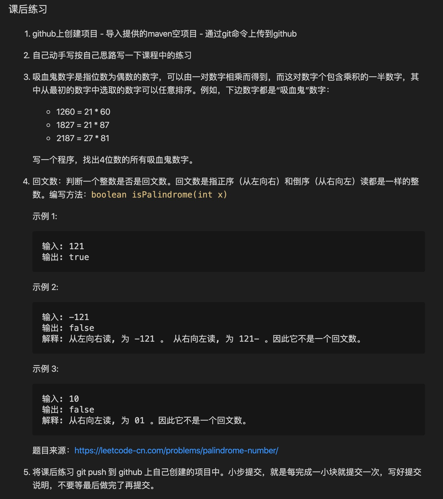

# Java Lesson

## Java流程控制语句
## 2019-12-05 

### 公告

1. 想让大家平时练习时就把 git 和 maven 用上，今晚讲一下它们的简单用法
   - 在 github 上创建项目
   - 创建 maven 项目，常见的配置，如何在 pom.xml 加入依赖项目
   - maven 编译
   - git 提交代码到 github 你创建的项目上
2. 条件、循环、循环嵌套等
3. 使用 LeetCode 上的一些和当前所学内容相关的算法题来作为课堂练习

### git + maven 的安装和使用

- maven 安装
    - 下载 maven 最新版本：https://maven.apache.org/download.cgi
    - 解压下载的安装包（例如：apache-maven-3.6.3-bin.zip）到某个目录
    - windows 环境下将目录 `maven解压目录\bin` 添加到环境变量 Path 上
    - mac 环境，在 `~/.bash_profile` 文件中加入一行，然后执行一下 `source ~/.bash_profile` 使之生效
        ```
        export PATH=/maven解压目录/bin:$PATH
        ```
    - 命令行下执行 `mvn --version`，如果能正确显示版本号，说明安装正确，比如显示内容如下：
        ```
        ➜  java-les mvn --version
        Apache Maven 3.6.1 (d66c9c0b3152b2e69ee9bac180bb8fcc8e6af555; 2019-04-05T03:00:29+08:00)
        Maven home: /Users/sh/bin/mvn
        Java version: 1.8.0_212, vendor: Oracle Corporation, runtime: /Library/Java/JavaVirtualMachines/jdk1.8.0_212.jdk/Contents/Home/jre
        Default locale: zh_CN, platform encoding: UTF-8
        OS name: "mac os x", version: "10.15", arch: "x86_64", family: "mac"
        ```
- 注册 github 账号
- 新建一个项目
    - 登录成功后，点击右上角【+】，在下拉菜单中选择【New repository】
    - 填写项目名（Repository name）和描述（Description）
    - 选择公共库（Public）、不使用 README.md 初始化
    - 点击【Create repository】进行创建
- 将自己项目上传 github
    - 下载 git，https://www.git-scm.com/download/
    - 安装后，进入命令行执行 `git --version`，如果能正常显示版本号说明安装正确，比如显示内容如下：
        ```
        ➜  java-les git --version
        git version 2.21.0
        ```
    - 设置 git 用户名、邮箱
        ```
        git config user.name
        git config user.email
        git config --global user.name "你的名字，显示在git提交历史记录里的名字"
        git config --global user.email "你的邮箱，显示在git提交历史记录里的邮箱"
        ```
    - 将示例空项目，按 maven 项目导入
    - 使用 git 命令初始化仓库，并将第一个版本上传
        ```
        git init
        git add .
        git commit -m "first commit"
        git remote add origin 你创建的github项目地址
        git push -u origin master
        ```
    - 提交成功后，到 github 上刷新，看一下效果
    - 如果使用 http 的 git 地址，如果嫌每次输入用户名密码麻烦的化，使用下面的命令可以记住密码
        ```
        git config --global credential.helper store
        ```
    - 修改一下 README.md，然后提交一下
        ```
        git status
        git add .
        git commit -m "本修改说明"
        git push
        ```
        `git add .` 是添加所有的变更，如果单独添加某个文件可以使用 `git add 单个文件路径名称`
    - 到 github 项目页面上刷新一下，看一下效果

### 程序控制执行流程
和其他语言一样，Java 使用条件语句和循环结构来控制程序流程。没有控制流程的话，程序就会顺序执行下去，这显然是不符合实际的。

#### 块作用域

学习控制结构之前，我们先来看一下块（block）的概念。

块（也可以叫复合语句）指的是由一对花括号括起来的若干语句的组合。块确定了变量的作用域。一个块可以嵌套在另一个块中。

什么是变量作用域，就是你定义的变量，可以在哪些地方被访问。块内定义的变量，只能被花括号括起来的代码访问（读/写）到，包括嵌套在它之内的其他子块。而在花括号范围之外，变量就不能被访问。

```
int n1 = 1;

{
    // int n1 = 11;
    int n2 = 2;
    System.out.println(n1);
    System.out.println(n2);

    {
        // int n1 = 111;
        // int n2 = 222;
        int n3 = 3;
        System.out.println(n1);
        System.out.println(n2);
        System.out.println(n3);
    }
}

int n2 = 22;
System.out.println(n2);

int n3 = 33;
System.out.println(n3);
```

#### 条件语句 if-else

条件语句：当某个条件成立时，执行一条或多条语句；如果条件不成立则执行另一条语句或另几条语句。主要有以下两种形式来使用：

```
// 单条语句
if (Boolean-Exception) 
    statement

// 单条或多条语句
if (Boolean-Exception) {
    statement1;
    statement2;
    ......
}
```

或者

```
// 单条语句
if (Boolean-Exception) 
    statement
else
    statement

// 单条或多条语句
if (Boolean-Exception) {
    statement1;
    statement2;
    ......
} else {
    statement1;
    statement2;
    ......
}
```

说明：statement 如果为单条语句可以不使用大括号括起来；如果是多条语句必须用大括号括起来，形成一个语法块。

下面我们来做一个示例：给定一个年龄，然后判断该年龄属于儿童、青年、中年还是老年；年龄使用 int 类型，只支持整数。年龄段的划分规则如下：

| 年龄范围  | 描述 |
| --------- | ---- |
| 0 ~ 6岁   | 儿童 |
| 7 ~ 17岁  | 少年 |
| 18 ~ 40岁 | 青年 |
| 41 ~ 59岁 | 中年 |
| 60及以上  | 老年 |

#### 循环

循环语句，有时我们也叫迭代语句。语句会重复执行，直到起控制作用当布尔表达式（BooleanException）为假（false）。

Java 中有 while、do-while 和 for 三类循环控制。

- while

    ```
    while (Boolean-Exception)
        statement
    ```

    当 `Boolean-Exception` 的结果为真（true）时，一直执行 `statement`，直到 `Boolean-Exception` 的结果为假（false）。

    练习：随机生成一个 `0 ～ 1000` 范围的整数，如果不能被30整除，则打印出数字，如果能被30整除则退出循环。生成 `0 ~ 1000` 范围的整数使用语句 `int r = new Random().nextInt(1000)`。

    ```
    boolean notContinue = true;
    while (notContinue) {
        int r = new Random().nextInt(1000);
        if (r % 30 == 0) {
            System.out.println("随机数：" + r + "能被30整除，不在执行循环");
            notContinue = false;
        } else {
            System.out.println("随机数：" + r);
        }
    }
    ```

- do-while

    ```
    do 
        statement
    while (Boolean-Exception)
    ```

    do-while 和 while 的区别是 do-while 语句至少会执行一次，当表达式 `Boolean-Exception` 为假（false）时，退出循环，不在执行下一次。

    练习：和 `while` 部分的练习一样，随机生成一个 `0 ～ 1000` 范围的整数，如果不能被30整除，则打印出数字，如果能被30整除则退出循环。

    ```
    boolean notContinue = true;
    do {
        int r = new Random().nextInt(1000);
        if (r % 30 == 0) {
            System.out.println("随机数：" + r + "能被30整除，不在执行循环");
            notContinue = false;
        } else {
            System.out.println("随机数：" + r);
        }
    } while (notContinue);
    ```

- for

    for 循环应该是一种总常用的循环，它的语法结构如下：

    ```
    for (initialization; Boolean-Exception; step)
        statement
    ```

    *执行过程*

    1. 执行初始化表达式 `initialization`。
    2. 执行布尔表达式 `Boolean-Exception`，如果结果为 false，退出循环；如果为 true，执行语法块 `statement`。
    3. `Boolean-Exception` = true 时，执行语法块 `statement`。
    4. 执行步进 `step` 运算。
        5。 跳转第 ii 步继续执行。

    *注意：* 初始化 `initialization`、布尔表达式 `Boolean-Exception` 和步进 `step` 都可以为空。

    练习：打印 `0 ~ 100` 范围内的单数并计算范围内单数的总个数。

    ```
    int total = 0;
    for (int i = 0; i <= 100; i++) {
        if (i % 2 != 0) {
            System.out.println("单数：" + i);
            total++;
        }
    }
    System.out.println("0 ~ 100之间的单数总个数是：" + total  + "个");
    ```

#### 多重选择 switch

当有多个选项时，如果使用 if-else 语法程序就会显得冗长笨拙，这时我们可以使用 switch 语句：

```
switch (integral-selector) {
    case integral-value1: statement; break;
    case integral-value2: statement; break;
    case integral-value3: statement; break;
    ......
    default: statement;
}
```

`Integral-selector`（整数选择因子）是一个能产生整数值的表达式。当产生的结果，和 case 后的值相等时，执行 case 后边的语句，直到 break 结束。

从 Java 5 开始，switch 可以使用枚举（Enum）；从 Java 7 开始，switch 可以使用字符串（String）这个放到后边相关章节来讲，这里只提一下。

练习：假如你有一个机器人，你通过输入数字指令来指挥机器人，比如输入 `1` 让机器人扫地，输入 `2` 让机器人打开灯。具体指令如下：

|数字指令    |执行命令
|----------|--------|
|1  |扫地
|2  |开灯
|3  |关灯
|4  |播放音乐
|5  |关闭音乐
|其他数字  |不能识别的指令

```
int cmdN = 1;
switch (cmdN) {
    case 1:
        System.out.println("扫地");
        break;
    case 2:
        System.out.println("开灯");
        break;
    case 3:
        System.out.println("关灯");
        break;
    case 4:
        System.out.println("播放音乐");
        break;
    case 5:
        System.out.println("关闭音乐");
        break;
    default:
        System.out.println("不能识别的指令");
}
```

#### 中断流程控制语句

当一个循环执行中，如果想要退出循环或者不再执行后边的语句直接进行下一次循环。我们就需要用到中断流程控制语句，包括：`return`、`break`、`continue`。

- return 中断当前循环并直接返回
- break 跳出循环，继续执行该循环体后边的语句
- continue 不再执行本次循环后边还未执行的语句，跳转循环开始的地方进行下一次循环的执行

练习1：还是前边的练习，我们来改写一下。随机生成一个 `0 ～ 1000` 范围的整数，如果不能被30整除，则打印出数字，如果能被30整除则退出循环。

```
while (true) {
    int r = new Random().nextInt(1000);
    if (r % 30 == 0) {
        System.out.println("随机数：" + r + "能被30整除，不在执行循环");
        break;
    } else {
        System.out.println("随机数：" + r);
    }
}
```

练习2：编写一个方法 `int getMaxNumRem7(int n1, int n2)` 找出 `0 ~ n2` 范围内除以 n1 余 7 的最大的数，找到则返回该数，如果找不到则返回 -1。

```
int getMaxNumRem7(int n1, int n2) {
    for (int n = n2; n >= 0; n--) {
        if (n % n1 == 7) {
            return n;
        }
    }
    return -1;
}
```

练习3：找出 `0 ~ 100` 范围内能被7整除的数，并计算它们累计相加的结果。

```
int total = 0;
for (int n = 0; n < 100; n++) {
    if (n % 7 != 0) {
        continue;
    }
    total += n;
    System.out.println(n + "能被7整除，累计结果：" + total);
}
System.out.println("0 ~ 100范围内能被7整除的数累计相加结果：" + total);
```

### 扩展：使用 TDD 方式来写一下前边一个练习

测试驱动开发（Test-Driven Development），简称 TDD。简单来说就是先写测试，再写实现。

题目：给定一个年龄，然后判断该年龄属于儿童、青年、中年还是老年；年龄使用 int 类型，只支持整数。


### 课后作业
