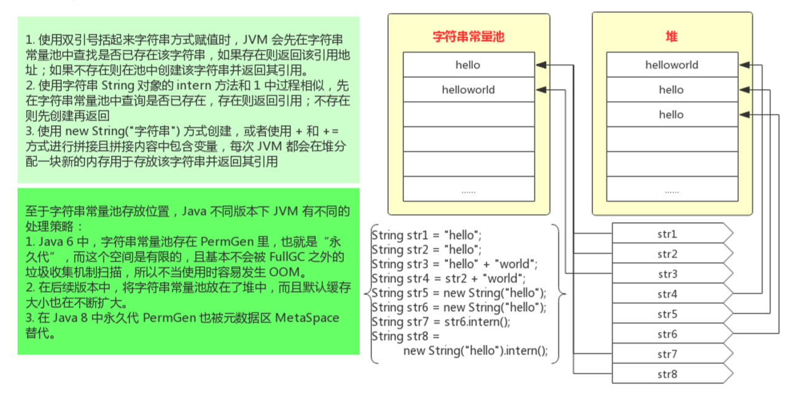

# Java Lesson

## Java字符串

## 2019-12-10

## 公告
> 今天我们学习 Java 开发中最常用的字符串类型
- 字符串
    - 字符串的定义、创建
    - 字符串常用操作：长度、子串、拼接等
    - String / StringBuffer /StringBuilder
    - JVM 对字符串的优化
    - 应用练习：使用 TDD 编写
    - 常见面试问题
- 课后练习

## 1. 字符串

### 1.1. 字符串定义
- Java字符串就是Unicode字符序列，由`char`序列组成。Java 没有内置的字符串类型，而是在标准 `Java` 类库中提供了一个预定义类 `String` ，每个用双引号括起来的字符串都是 `String` 类的一个实例，可以通过直接赋值或者 `new` 操作符来创建字符串
    - 什么是预定义类：指的是已经定义好的类，例如 `String` 、`Integer`，这些预定义的类都在java.lang包里，jvm会默认加载这个包里面的所有类到JVM
    - 在java.lang包里面的类不需要引用
    - 对于其他的预定义类，例如：java.util包里面的，是必须要引入才可以使用
        - 例如使用ArrayList，必须在程序前导入：import java.util.ArrayList
```
String str1 = "";
String str2 = "Hello, This is a string!"
String str3 = new String("Create string with new");
```
`String` 类没有提供用于修改字符串的方法，所以我们将 `String` 类对象称为不可变字符串，它被声明为 `final class`，所有的属性也被定义为 `final` 的。但是我们可以修改字符串变量，让它指向另外一个字符串

为了提高内存利用率，`JVM` 有一个字符串常量池，每次使用双引号定义字符串，JVM 会先到该 `常量池` 中来检测是否已经存在，存在则直接该对象的引用；否则在常量池中创建一个新增并返回该值的引用

使用 `new` 创建字符串（`new String("字符串");`）时，会直接在堆中创建该字符串并返回其引用。

从 Java 6 开始，String 类提供了 `intern()` 方法，调用该方法时，`JVM` 去字符串常量池检测是否已存在该字符串，如果已经存在则直接返回引用；如果不存在则在常量池中添加并返回其引用

Java 6 中，字符串常量池存在 PermGen 里，也就是(“永久代”)，而这个空间是有限的，基本不会被 FullGC 之外的垃圾收集机制扫描。如果使用不当，经常会发生 OOM(宕机)。在后续版本中，将字符串常量池放在了堆中，而且默认缓存大小也在不断扩大。在 Java 8 中永久代 PermGen 也被元数据区 MetaSpace 替代

String字符串内存使用示意图



下面通过一些示例来验证一下：
```
String str1 = "hello";
String str2 = "hello";
String str3 = "hello" + "world";
String str4 = str2 + "world";
String str5 = new String("hello");
String str6 = new String("hello");
String str7 = str6.intern();
String str8 = new String("hello").intern();

System.out.println("str1 = str2, " + (str1 == str2));
System.out.println("str3 = str4, " + (str3 == str4));
System.out.println("str1 = str5, " + (str1 == str5));
System.out.println("str5 = str6, " + (str5 == str6));
System.out.println("str1 = str7, " + (str1 == str7));
System.out.println("str1 = str8, " + (str1 == str8));

String str9 = "hello";
str9 += "world";
System.out.println("str3 = str9, " + (str3 == str9));
```
### 1.2. 字符串操作

1.长度

`int length()` 返回采⽤ UTF-16 编码表示的给定字符串所需要的代码单元数量。也即是 String 类内部 char 数组的⻓度。（char 数据类型是⼀个采⽤ UTF-16 编码表示 Unicode 代码点的代码单元）
```
String str = "HelloWorld";
System.out.println(str + "字符串长度为：" + str.length());
```


`int codePointCount(int beginIndex, int endIndex)` 表示字符串的实际⻓度，即代码点数

经过研究发现：对于普通字符串，这两种方法得到的值是一样的，但对于UniCode编码来说，还是有一点区别。

实际情况是 `length()` 方法返回的是使用的是UTF-16编码的字符代码单元数量，不一定是实际上我们认为的字符个数。同理 `codePointCount()` 方法返回的是代码点个数，是实际上的字符个数

```
String str = "HelloWorld";
System.out.println(str + "字符串长度为：" + str.length());
System.out.println(str + "字符串长度为：" + str.codePointCount(0, str.length()));
```

2.子串

`String` 类的 `substring` 方法可以从一个较大的字符串提取出一个子串

- String substring(int beginIndex);
- String substring(int beginIndex, int endIndex);
 
```
String str3 = "miss you";
System.out.println(str3.substring(5));  // you
System.out.println(str3.substring(3,6));    // s y
```

3.拼接

与绝大多数的程序设计语言一样，java语言允许使用 `+` 号或者 `+=` 号连接(拼接)字符串
```
String str4 = "big" + "data";
System.out.println(str4);
String str5 = "java";
str5 += str4;
System.out.println(str5);
```

4.格式化

为了让字符串拼接更简洁直观，我们可以使⽤字符串格式化⽅法 String.format 

```
System.out.printf("hello, %s %n", "world");
System.out.printf("⼤写a：%c %n", 'A');
System.out.printf("100 > 50：%b %n", 100 > 50);
System.out.printf("100除以2：%d %n", 100 / 2);
System.out.printf("100的16进制数是：%x %n", 100);
System.out.printf("100的8进制数是：%o %n", 100);
System.out.printf("100元打8.5折扣是：%f 元%n", 100 * 0.85);
System.out.printf("上述价格的16进制数是：%a %n", 50 * 0.85);
System.out.printf("上⾯的折扣是%d%% %n", 85); // %转义
```

5.判断相等
- `equals` 判断是否相等
- `equalsIgnorceCase` 不区分大小写判断是否相等

注：一定不能使用 `==` 运算符检测两个值是否相等！这个运算符只能够确定两个字符串是否放置在同一个位置上。当然，如果字符串放置在同一个位置上，它们必然相等，但是完全有可能将内容相同的多个字符串拷贝放置在士的位置上，例如：
```
String greeting = "hello";
System.out.println(greeting == "hello");    // true
System.out.println(greeting.substring(1,3) == "hel");   //false

```
```
String str7 = "Hello";
String str8 = "hello";
System.out.println("str7 = str8 为：" + str7.equals(str8));
System.out.println("str7 = str8 为：" + str7.equalsIgnoreCase(str8));
```

6.前后缀、包含判断
- `stratsWith()` 前缀判断
- `endsWith()` 后缀判断
```
String str9 = "JavaWeb";
System.out.println(str9 + "是否以J开头：" + str9.startsWith("J"));
System.out.println(str9 + "是否以b结束：" + str9.endsWith("b"));
System.out.println(str9 + "是否包含aWe：" + str9.contains("aWe"));
```

7.查找
- `indexOf` 从前边查找
- `lastIndexOf` 从后边开始找
```
String str10 = "Hello World, today is 2019-12-11. say hi to me!";
System.out.println(str10.indexOf("e"));     // 字符串索引从0开始计算
System.out.println(str10.indexOf("H", 2));  // 从索引2开始没有找到H，返回-1
System.out.println(str10.lastIndexOf("!"));

// 从前往后找
public void testFindForward(){
    String str12 = "Hello World, today is 2019-12-11. say hi to me!";
    int index = -1;
    int total = 0;
    do {
        int at = str12.indexOf("o", index+1);
        if (at == -1){
            break;
        }
        System.out.println(String.format("第%d位是小写字母o", at+1));
        index = at;
        total++;
    }while(true);
    System.out.println("该字符串中一共有" + total + "个小写字母o");

}
// 从后往前找
public void testFindBack(){
    String str13 = "Hello World, today is 2019-12-11. say hi to me!";
    int index = str13.length();
    int total = 0;
    do {
        int at = str13.lastIndexOf("o", index-1);
        if (at == -1) break;
        System.out.println(String.format("第%d位是小写字母：o", at+1));
        index = at;
        total++;
    }while (true);
    System.out.println("该字符串中一共有" + total + "个小写字母o");
}
```

8.替换
- `replace` 替换
- `replaceAll` 全部替换
```
public void testReplace(){
    String str14 = "xian jia yu";
    System.out.println(str14.replace("jia", "j")); // xian j yu
    System.out.println(str14.replaceAll(" ", "")); // regx:正则  xianjiayu
}
```

9.大小写转换
- `toUpperCase` 大写转换
- `toLowerCase` 小写转换
```
//大小写转换
String str15 = "xian jia Yu";
System.out.println(str15 + "大写转换后：" + str15.toUpperCase());
System.out.println(str15 + "小写转换后：" + str15.toLowerCase());
```
  
10.去空格
- `trim()` 去空格
```
public void testTrim(){
    // 两边去空格
    String str16 = "   he l l o  ";
    System.out.println(str16.trim());
    }
```

11.空串和null串
- `空串`： 空串是⼀个⻓度为0且内容为空的 String 对象
- `null`： String 存放 null，表示没有任何对象与该变量关联
```
public void testEmpty(){
    // 空串
    String str17 = ""; // 代表空的字符串
    System.out.println(str17);
    String str18 = null; // 代表存放的是空置，没有对齐进行初始化
    System.out.println(str18);
}
```
 
### 1.3 String/StringBuilder/StringBuffer
1. String 在拼接过程中或操作不当时，可能会产⽣⼤量的中间对象。⽽ `StringBuffer` 就是为了解决这个问题⽽提供 的⼀个类，`StringBuffer` 是线程安全的，如果没有线程安全的需要则使⽤ `StringBuilder（Java 1.5 中新增）`。

2. `StringBuffer` 和 `StringBuilder` 都继承⾃ `AbstractStringBuilder` 类，⽽ `StringBuffer` 类的所有⽅法都使⽤关键字 `synchronized` 来保证线程安全。它们的底层都是通过可修改的 `char` 数组（Java 9 以后改为 byte 数组实现）来实现修改。以下内容没有特别说明则均基于 Java 8。
 
3. `StringBuffer`和 `StringBuilder` 在创建时，如果未指定容量，默认容量为 16。如果容量可预估，则最好在创建时指 定合适的⼤⼩，这样可以避免多次扩容。扩容会产⽣多重开销：抛弃原有数组、创建新的数组、进⾏ arraycopy。

4. `StringBuffer` 和 `StringBuilder` 区别
- `StringBuffer` 是安全的，使用了关键字：`synchronized`
- `StringBuilder` 是不安全的

5. `StringBuffer` 和 `StringBuilder` 的常用方法
- `append` 在字符串结尾追加
- `length` 返回当前长度
- `setLength` 设置字符串长度
```
public void testAppendOrLength(){
    // 拼接：+    如果JVM没有优化时，会产生多个中间(临时)变量，坑能会导致内存溢出
    String str1 = "Hello";
    str1 += ',';    // 单引号中只能写入字符，并且是单个字符
    str1 += "World";
    str1 += '!';
    System.out.println(String.format("拼接后的结果为：%s", str1));

    // 追加：append
    StringBuilder sb = new StringBuilder();
    sb.append("Hello");
    sb.append(',');
    sb.append("World");
    sb.append('!');
    // 在未执行toString方法前，JVM都是把这些字符串放在数组中，不会产生临时变量
    System.out.println(String.format("拼接后的结果为：%s", sb.toString()));
    // 打印sb的长度
    System.out.println(String.format("拼接后字符串的长度为为：%s", sb.length()));
    // 设置sb的长度为10
    sb.setLength(10);
    System.out.println(sb.toString()); // Hello,Worl
    // 设置sb的长度为20
    sb.setLength(20);
    System.out.println(sb.toString()); //Hello,Worl          10个空格
}
```

### 1.4 JVM对字符串的优化
- 现代 JVM 的实现是很智能的，编译时 JVM 对 String 操作进⾏⼀些优化以提⾼程序的运⾏效率。
> 示例1-优化前 
```
String str = "hello" + ", " + "world!"; 
System.out.println(str); 
```
> JVM优化后
```
String str = "hello, world!"; 
System.out.println(str); 
```
> 示例2-优化前 
```
String str1 = "hello"; String str2 = str1 + ", world!"; 
System.out.println(str2); 
```
> JVM优化后
```
String str1 = "hello"; StringBuilder str2 = new StringBuilder(); 
str2.append(str1); 
str2.append(", world!"); 
System.out.println(str2.toString()); 
```
> 示例3-优化前 
```
/*
  一般写法
*/
long start = System.currentTimeMillis();   // 查看当前时间毫秒数
String str = "";
for (int n = 0; n < 20000; n++){
    str += n;
}
System.out.println(str.length());
System.out.println(String.format("优化前耗时:%d ms", System.currentTimeMillis() - start));
```
> JVM优化后
```
/*
    JVM虚拟机优化后的
*/
start = System.currentTimeMillis();   // 查看当前时间毫秒数
str = "";
for (int n = 0; n < 20000; n++){
    /*
      虽然节省了部分时间和中间变量，但是该StringBuilder实在for循环内部，每循环一次都会创建一次对象
     */
    StringBuilder sb = new StringBuilder();
    sb.append(str);
    sb.append(n);
    str = sb.toString();
}
System.out.println(str.length());
System.out.println(String.format("优化后耗时:%d ms", System.currentTimeMillis() - start));
```
- for 循环经过优化后，虽然节省了空间，但是 StringBuilder 是在 for 循环内，每次都会创建。性能并不会提升， 反⽽可能会下降。按下边实现⽅式改写代码后性能提升好⼏个数量级。

> 自己写，将StingBuilder放在循环外
```
/*
 自己写：将StingBuilder放在循环外
*/
start = System.currentTimeMillis();   // 查看当前时间毫秒数
str = "";
StringBuilder sb2 = new StringBuilder();
for (int n = 0; n < 20000; n++){
    sb2.append(n);
}
str = sb2.toString();
System.out.println(str.length());
System.out.println(String.format("自己写耗时:%d ms", System.currentTimeMillis() - start));
```
说明：可以通过反编译方法查看代码编译的过程

- 反编译命令：javap -c ./target/test-classes/com/zeroten/string/StringTest.class

## 课程应用练习

1. 去掉字符串开头/结尾/中间的空格（不使⽤ trim ⽅法）
```
public static String trimAll(String str){

    // 对字符串进去去空格，首先要知道的对象是字符串
    StringBuffer sb = new StringBuffer();
    // 对传进来的字符串进行for循环，然后进行判断和操作
    for (int index = 0; index < str.length(); index++){
        // 获取字符串的某个字符：str.charAt(index)方法
        if (str.charAt(index) == ' '){
            // 在循环过程中如果字符等于空，执行continue：不执行本次循环，跳转到循环开始的地方继续执行下一次循环
            continue;
        }
        sb.append(str.charAt(index));
    }
    System.out.println(sb.toString());
    return sb.toString();
}

public static String trimAllChar(String str){
    // 因为我们都知道String的底层是通过char来实现的，所以可以先把str取出来
    char[] ch = str.toCharArray();

    StringBuffer sb = new StringBuffer();

    for (int index = 0; index < ch.length; index++){
        if (ch[index] == ' ') continue;
        sb.append(ch[index]);
    }
    return sb.toString();
}
```

2. 反转字符串，⽐如输⼊ 123，反转结果 321
```
public static String reverseStr(String str) {
    StringBuffer sb = new StringBuffer();
    char[] ch = str.toCharArray();
    for (int index=ch.length-1; index >= 0; index--){
        sb.append(ch[index]);
    }
    return sb.toString();
}
```

## 常见面试题

1.`==` 和 `equals` 的区别
- `==` 对于基本类型来说是值⽐较，⽽对于引⽤类型⽐较的是引⽤，是否是指向同⼀个对象的引⽤。 
- `equals` 默认是引⽤⽐较，⽽ Integer、String 等包装类都重写了 equals ⽅法，改为了值⽐较。 

所以对象都可以看作是继承⾃ Object，我们来看⼀下 Object 的 equals 实现，如果⾃定义类未覆写 equals， 调⽤对象实例的 equals ⽅法默认是引⽤⽐较。

```
public boolean equals(Object obj) {     
    return (this == obj); 
} 
```

我们再来看⼀下 Integer 类的 equals ⽅法
```
public boolean equals(Object obj) {     
    if (obj instanceof Integer) {         
        return value == ((Integer)obj).intValue();     
    }     
    return false; 
} 
```

2.`String` 、`StringBuffer` 和 `StringBuilder` 的区别
- `String` 为不可变字符串；StringBuffer 和 StringBuilder 为字符串可变对象。 
- `String` 的 substring 等修改操作每次都会产⽣⼀个新的 String 对象；字符串拼接性能 String 低于 StringBuffer，⽽ StringBuffer 低于 StringBuilder。 
- `StringBuffer` 是线程安全的，`StringBuilder` ⽽线程不安全的。⼆者都是继承⾃ AbstractStringBuilder ，它 们的唯⼀区别是 StringBuffer 的所有⽅法都使⽤了 synchronized 修饰符来保证线程安全。

3.String 对象的 intern 的作⽤
- String 对象的 intern ⽅法⽤于字符串的显示排重。调⽤此⽅法时，JVM 去字符串常量池查找池中是否已经存在 该字符串，如果已存在则直接返回它的引⽤；如果不存在则在池中先创建然后返回其引⽤。

4.String 不可变性的优点
- 字符串不可变，因此可以通过字符串常量池来实现，共享对象，从⽽节省空间，提⾼性能
- 多线程安全，因为字符串不可变，所以当字符串被多个线程共享时不会存在线程安全问题
- 适合做缓存的 Key，因为字符串不可变，因此它的哈希值也就不变；创建时它的哈希值就被缓存了，不 需要重新计算，速度更快

5.String 是否可以被继承
- String 不能被继承。因为 String 被声明为 final，所以不能被继承

## 课后练习

1.⾃⼰编写练习⼀下课程中的示例和练习。

2.编写数据验证⼯具类，并编写相应单元测试⽤例，具体要求如下：

- GitHub 上创建项⽬ java-common-tools 
- 创建 maven 项⽬（使⽤⾃⼰熟悉的IDE），并提交到 GitHub 上
- 创建数据验证⼯具类 com.zeroten.common.util.CheckUtils。（src/main/java⽬录下） 
- 为⼯具类编写如下数据验证⽅法（使⽤静态⽅法）：
    1. public static boolean isAnyEmpty(String... strings)
      
      String... strings 为可变参数，你可以认为它是 String[] strings。如果 strings 中有任 意⼀个字符串为空，则返回 false，否则返回 true。
    2. public static boolean isEmpty(Object[] arr)
      
      判断引⽤类型数组是否为空，为空或 null 则返回 true，否则返回 false。

    3. public static boolean equals(String str1, String str2)
     
      判断 str1 字符串是否相等，相等则返回 true，否则返回 false。当其中⼀个是 null 时返回 false。
    4. public static boolean equals(Integer n1, Integer n2)
    
      判断 n1 和 n2 的值是否相等，相等则返回 true，否则返回 false。当其中⼀个是 null 时返回 false。
- 编写测试类 com.zeroten.common.util.CheckUtilsTest（src/main/test⽬录下）对数据验证⼯具类进 ⾏测试，设计的测试⽤例尽量把各种输⼊情况都考虑到。 
- 将作业提交 GitHub 并写清楚提交说明。

3.注册 LeanCloud 账号，并试着创建应⽤，安装它的客户端⼯具。
- 后边 web 部分会⽤到 LeanCloud 来托管咱们⾃⼰写的应⽤，提前注册熟悉⼀下
- ⽹址： https://www.leancloud.cn/


    
        


